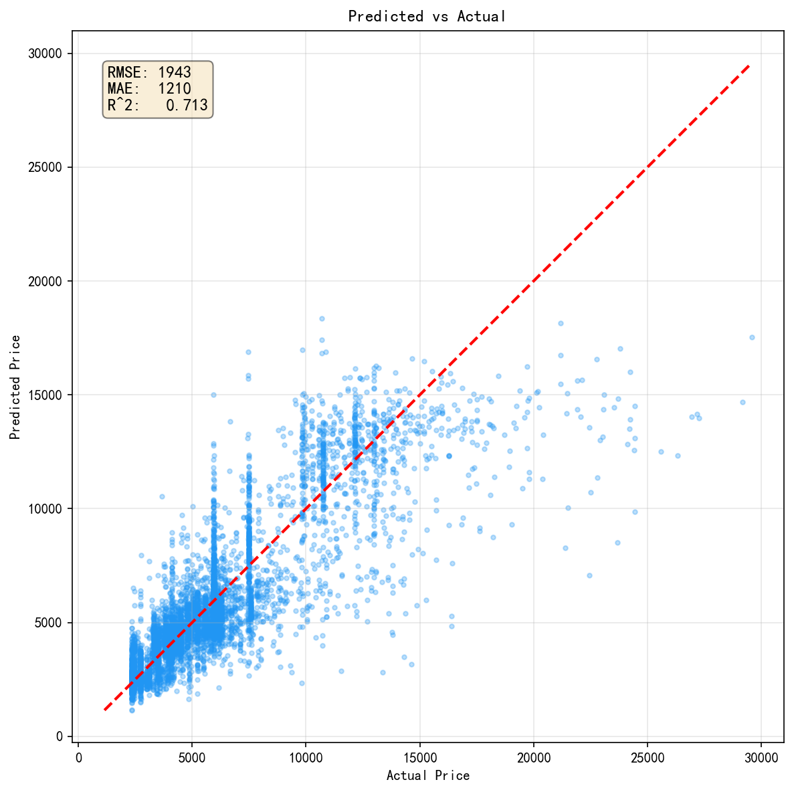

# Transformer from Scratch — 航班价格预测

[](LICENSE)
[](requirements.txt)

纯 **NumPy** 从零实现的 Transformer（含完整前向/反向传播），并应用于印度国内航班机票价格回归预测。

> 不依赖 PyTorch、TensorFlow 等深度学习框架。核心库约 1,500 行，配套单元测试、研究报告与可视化结果。

**仓库地址**：[github.com/MIKE-He-525/Transformer-from-Scratch](https://github.com/MIKE-He-525/Transformer-from-Scratch)

---

## 特性

- **手写 Transformer 全栈**：Embedding、Multi-Head Attention、Feed-Forward、LayerNorm、Encoder / Decoder
- **Encoder-only 回归**：将 22 维航班特征映射为标量价格
- **多航线联合训练**：Bangalore→Delhi、Delhi→Mumbai、Mumbai→Delhi
- **完整测试套件**：11 项单元测试，覆盖导入、形状、反向传播与收敛
- **可视化分析**：训练过程自动生成 7 类分析图表（已包含在仓库中）

---

## 项目结构

```
Transformer-from-Scratch/
├── transformer/              # 核心库（纯 NumPy Transformer 实现）
│   ├── embedding.py          # 词嵌入 + 正弦位置编码
│   ├── attention.py          # 缩放点积注意力 + 多头注意力
│   ├── feed_forward.py       # 前馈网络
│   ├── normalization.py      # LayerNorm + Pre-LN 残差连接
│   ├── encoder.py            # 编码器
│   ├── decoder.py            # 解码器
│   ├── model.py              # 完整 Seq2Seq Transformer
│   └── utils.py              # Mask 工具函数
├── flight_price_predictor.py # 航班价格预测主程序
├── test_transformer.py       # 单元测试
├── 研究报告.md               # 完整研究报告（原理、实验、分析）
├── results_economy/          # 经济舱训练可视化结果（7 张图）
├── results_business/         # 商务舱训练可视化结果（7 张图）
├── dataset/                  # 数据集（需自行准备，见下方说明）
├── requirements.txt
└── LICENSE
```

---

## 环境要求

- Python 3.10+
- NumPy、Pandas、Matplotlib

---

## 快速开始

```bash
# 克隆仓库
git clone https://github.com/MIKE-He-525/Transformer-from-Scratch.git
cd Transformer-from-Scratch

# 安装依赖
pip install -r requirements.txt

# 准备数据集（放入 dataset/ 目录，见「数据集」章节）

# 运行测试（验证 Transformer 实现）
python test_transformer.py

# 训练模型并生成可视化（约需数分钟）
python flight_price_predictor.py
```

训练完成后，新图表将保存至 `results_economy/` 和 `results_business/`。

---

## 实验结果

| 指标 | 经济舱 | 商务舱 |
|------|--------|--------|
| R² | 0.721 | 0.68 |
| RMSE | ~1,570 元 | ~2,900 元 |
| MAE | ~1,210 元 | ~2,200 元 |
| 相对误差 (MAE/均价) | ~20.2% | ~19.7% |

**主要发现**

- 提前 **34–39 天** 购票价格最低，临飞前购票可比最优时机贵约 **73%**
- `days_left`（距起飞天数）是最显著的价格驱动因素
- 多航线联合训练相比单航线模型，MSE 下降约 **9.6%**

详细推导、实验设置与特征分析见 [研究报告.md](研究报告.md)。

### 可视化结果预览

| 图表 | 说明 |
|------|------|
| `01_data_distribution` | 价格分布、天数-价格关系 |
| `02_feature_importance` | 特征重要性 |
| `03_training_curves` | 训练 / 验证 RMSE 曲线 |
| `04_days_left_analysis` | 提前购票天数敏感性 |
| `05_booking_timeline` | 最优购票时机 |
| `06_feature_sensitivity` | 各特征对价格的影响 |
| `07_prediction_scatter` | 预测 vs 实际散点图 |

示例（经济舱预测散点图）：



---

## 数据集

本项目使用 Kaggle 航班价格预测数据集。由于体积较大，**数据集未纳入 Git 仓库**，需自行下载后放入 `dataset/` 目录。

**目录结构示例：**

```
dataset/
├── train_bangalore_delhi_economy.csv
├── test_bangalore_delhi_economy.csv
├── train_delhi_mumbai_economy.csv
├── test_delhi_mumbai_economy.csv
├── train_mumbai_delhi_economy.csv
├── test_mumbai_delhi_economy.csv
└── ...（商务舱 train/test 文件同理）
```

**特征说明（22 维）：**

| 特征 | 说明 |
|------|------|
| `stops` | 经停次数（0 / 1 / 2） |
| `class` | 舱位（0=经济舱，1=商务舱） |
| `duration` | 飞行时长（标准化） |
| `days_left` | 距起飞天数（标准化） |
| `airline_*` | 航空公司独热编码 |
| `departure_time_*` / `arrival_time_*` | 出发 / 到达时段独热编码 |
| `route_*` | 航线独热编码 |

---

## 模型架构

```
航班特征 (22 维)
    │
    ▼
Continuous Embedding  →  Positional Encoding
    │
    ▼
Encoder Layer × 3  (Self-Attention + FFN)
    │
    ▼
LayerNorm  →  Linear  →  预测价格
```

完整 Seq2Seq Transformer（Encoder + Decoder）实现在 `transformer/model.py`，可用于序列到序列任务；航班预测使用 Encoder-only 变体，见 `flight_price_predictor.py`。

---

## 引用

若本项目对你有帮助，欢迎 Star ⭐

> Vaswani, A., et al. *Attention Is All You Need.* NeurIPS 2017.

---

## License

[MIT](LICENSE) © MIKE-HE-525
